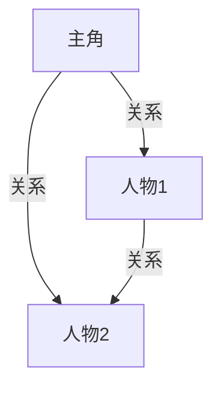

# 《译文 名著文库 漂亮朋友》人物关系分析

## 主要人物

### [人物1]
- **身份**：
- **性格特点**：
- **与主角关系**：
- **关键事件**：

### [人物2]
- **身份**：
- **性格特点**：
- **与主角关系**：
- **关键事件**：

## 人物关系图

```mermaid
graph TD
    A[主角] -->|关系| B[人物1]
    A -->|关系| C[人物2]
    B -->|关系| C
```

[返回目录](/mdRead/reader.html?book=漂亮朋友)
